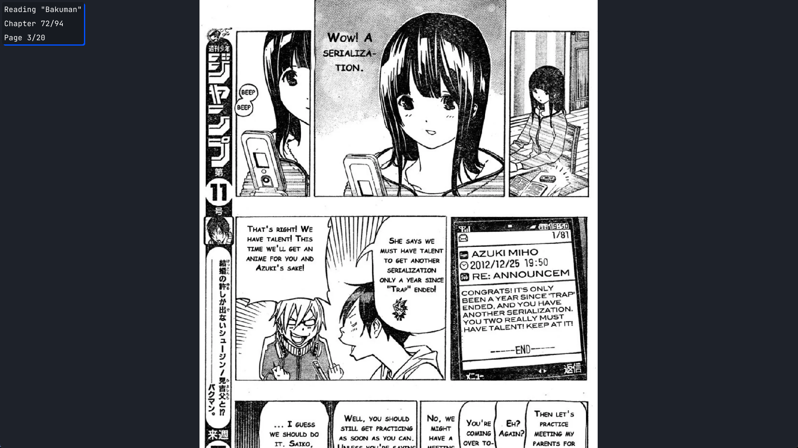
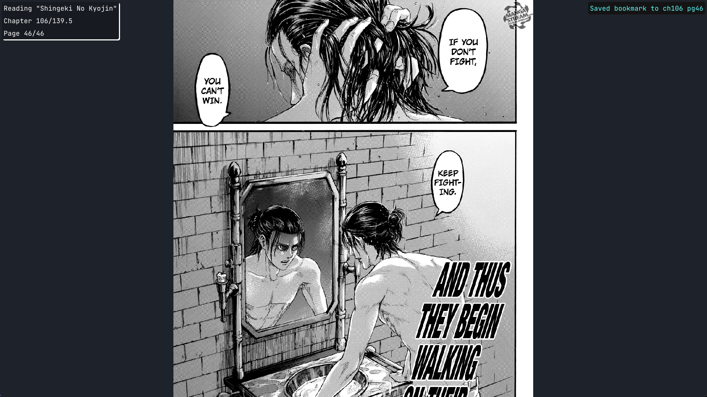

# Ruider


> I honestly have no idea why i named it ruider

## About

A very humble manga reader that focuses on reading pre-downloaded mangas with a simple minimal and the "pro" (lies) style keybindings for the casual manga reading experience.

**NOTE:** Ruider is a very simple manga reader that does not download any copyrighted content. The only external assets used are the app icon and font file (icon from "The Gods Lie" manga and "Jetbrains Mono" font from Jetbrains)

**NOTE:** Ruider sets some standards regarding how you store manga files. But they will be easy to follow.

## Manual

### Setup

1. Clone the repo to desired directory
2. Navigate to the directory 
3. Install dependencies using `pip install -r requirements.txt`
4. You can create symlinks or shortcuts so you can run the file from anywhere (optional).
5. Download your favourate mangas to your desired directory. The format should be:
  
  ```python
  /manga_dir
    ./manga name # Your manga name
      1.pdf    # Chapters (can be any name but include chapter number. do not include other numbers. see Naming Convention below for more info.)
      2.pdf
      ...
  ```

  You can also download single chapter image only mangas, like from *cough cough* nmanga.net

  ```python
  /manga_dir
  ./manga name
    1.png
    2.png
    3.png
  ```

6. Create `config.toml` in the installation directory and pecify your manga dir in it

  ```toml
  manga_home = ["/path/to/manga/directory"] # Highly recommended to use absolute path
  ```

### Usage

1. Run `ruider.py` with the name of the manga you want to read:

  Ex: `python ruider.py shingeki no kyojin`
  
  **NOTE:** Manga name is case in-sensitive.

  Thats it!

  If you setup with symlinks you can just use
  `ruider shingeki no kyojin`

2. Navigation through pages using arrow keys.
3. You can navigate through pages using `+` and `-` keys.
4. You can navigate through chapters using numpad `+` and `-` keys.
5. You can hide image by pressing `r` key. Same key to show image.
  This is useful when navigation as it speeds up the app.
6. You can bookmark the page and chapter by using `b` key.
  You can jump to the bookmark with `j` key.
  There can only be only one bookmark per manga.
7. You can save current page as an image using `s` key.

### Naming convention

- "Platinum end - 01.pdf" -- works, loads as chapter 1
- "Platinum end - 01.07.pdf" -- works, loads as chapter 1.07 (in manga terms this is chapters 1-7 or volume 1)
- "1.pdf" -- works, loads as chapter 1
- "Otter no. 11 - 1.pdf" -- doesnt work, it must only contain chapter number. otherwise 11 is taken as chapter number and it breaks. (doesnt show any error).

### Extra features

- It remembers your last opened manga, so you can just type `python ruider.py` (or `ruider` for symlink (bat script)) and it will open the manga you opened in previous session.

### Notes

- Extensive configuration will be added later.
- The app might be buggy or might crash. Please report issues or enhancement requests in `issues` tab of the repo.
- This is personal project dont expect the most professional looking app. It just works.
- I recommend you use hakuneko for downloading mangas.
- Only pdfs and images are supported

## Pictures

1. Demo 
2. Jumping to bookmark 
3. Setting a bookmark 
4. How bookmarks are stored 

## Commands

```shell
$ ruider -s
You spent exactly 16885 seconds using ruider to read manga.
        That is, 281 minutes
        Or 4 hours

You spent 511 seconds (0 hours 9 minute(s)) reading "Shingeki No Kyojin"
You spent so many seconds (many hours many minute(s)) reading "Mein Kampf"
You spent 5172 seconds (1 hours 27 minute(s)) reading "All You Need Is Kill"
You spent 3049 seconds (0 hours 51 minute(s)) reading "Kimetsu No Yaiba"
You spent 6577 seconds (1 hours 50 minute(s)) reading "Bakuman"
You spent 610 seconds (0 hours 11 minute(s)) reading "secret"
You spent 68 seconds (0 hours 2 minute(s)) reading "secret"
You spent 197 seconds (0 hours 4 minute(s)) reading "secret"
You spent 481 seconds (0 hours 9 minute(s)) reading "secret"
You spent 129 seconds (0 hours 3 minute(s)) reading "secret"
You spent 22 seconds (0 hours 1 minute(s)) reading "Platinum End"
You spent 45 seconds (0 hours 1 minute(s)) reading "Real Account"
$
```

**NOTE:** I lost most of my history when fixing some stuff but yeah, you wont.

```shell
$ ruider -f
Deleted invalid entry: secret
Deleted invalid entry: secret
Deleted invalid entry: secret
Deleted invalid entry: secret
Deleted invalid entry: secret
$ 
```

**NOTE:** This command deletes invalid entries in history file, like when you delete mangas.

```shell
$ ruider -l
[1]: All You Need Is Kill - 17 chapter(s)
[2]: Bakuman - 94 chapter(s)
[3]: Kimetsu no Yaiba - 22 chapter(s)
[4]: Koe no Katachi - 20 chapter(s)
[5]: Mein kampf - 1 chapter(s)
[6]: Parasyte - 4 chapter(s)
[7]: Platinum End - 8 chapter(s)
[8]: Pluto - 13 chapter(s)
[9]: Real Account - 10 chapter(s)
[10]: Shingeki no Kyojin - 148 chapter(s)
[11]: The Gods Lie - 1 chapter(s)
$ 
```

**NOTE:** This command lists all mangas from all manga homes in order it interprets it. So, when you type the starting characters of the manga name, it autocompletes to the first match. You can lookup the output of this command to see if it autocompletes to the intended manga.
